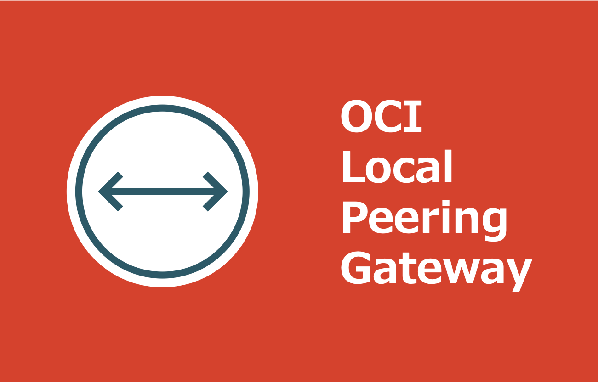

=====================================================================
OCI Local Peering Gateway で同一リージョン VCN 間を接続する
=====================================================================
* `詳細 <>`_

=====================================================================
構成図
=====================================================================
.. image:: ./doc/drawio/architecture.drawio.png

=====================================================================
デプロイ - Terraform -
=====================================================================

作業環境 - ローカル -
=====================================================================
* macOS Tahoe ( v26.3.1(a) )
* Visual Studio Code 1.113.0
* Terraform v1.15.1
* oci cli 3.71.0
* Python 3.14.2

フォルダ構成
=====================================================================
* `こちら <./folder.md>`_ を参照

前提条件
=====================================================================
* ``manage all-resources IN TENANCY`` を付与した IAM グループに所属する IAM ユーザーが作成されていること

事前作業 - ローカル -
=====================================================================
1. 定義ファイルの圧縮
---------------------------------------------------------------------
.. code-block:: bash

  zip -r stack.zip *.tf .terraform-version schema.yml modules

実作業 - OCI Resource Manager -
=====================================================================

参考資料
=====================================================================
リファレンス
---------------------------------------------------------------------
* `terraform_data resource reference <https://developer.hashicorp.com/terraform/language/resources/terraform-data>`_
* `Backend block configuration overview <https://developer.hashicorp.com/terraform/language/backend#partial-configuration>`_
* `All Image Families - Oracle Cloud Infrastructure Documentation/Images <https://docs.oracle.com/en-us/iaas/images/>`_
* `タグおよびタグ・ネームスペースの概念 - Oracle Cloud Infrastructureドキュメント <https://docs.oracle.com/ja-jp/iaas/Content/Tagging/Tasks/managingtagsandtagnamespaces.htm#Who>`_
* `About the DNS Domains and Hostnames - Oracle Cloud Infrastructure Documentation <https://docs.oracle.com/en-us/iaas/Content/Network/Concepts/dns.htm#About>`_

ブログ
---------------------------------------------------------------------
* `Terraformでmoduleを使わずに複数環境を構築する - Zenn <https://zenn.dev/smartround_dev/articles/5e20fa7223f0fd>`_
* `Terraformでmoduleを使わずに複数環境を構築して感じた利点 - SpeakerDeck <https://speakerdeck.com/shonansurvivors/building-multiple-environments-without-using-modules-in-terraform>`_
* `個人的備忘録：Terraformディレクトリ整理の個人メモ（ファイル分割編） - Qiita <https://qiita.com/free-honda/items/5484328d5b52326ed87e>`_
* `Terraformの auto.tfvars を使うと、環境管理がずっと楽になる話 - note <https://note.com/minato_kame/n/neb271c81e0e2>`_
* `Terraform v1.9 では null_resource を安全に terraform_data に置き換えることができる -Zenn <https://zenn.dev/terraform_jp/articles/tf-null-resource-to-terraform-data>`_
* `Terraform cloudinit Provider を使って MIME multi-part 形式の cloud-init 設定を管理する - HatenaBlog <https://chaya2z.hatenablog.jp/entry/2025/10/15/040000>`_
* `TerraformのDynamic Blocksを使ってみた - DevelopersIO <https://dev.classmethod.jp/articles/terraform-dynamic-blocks/>`_